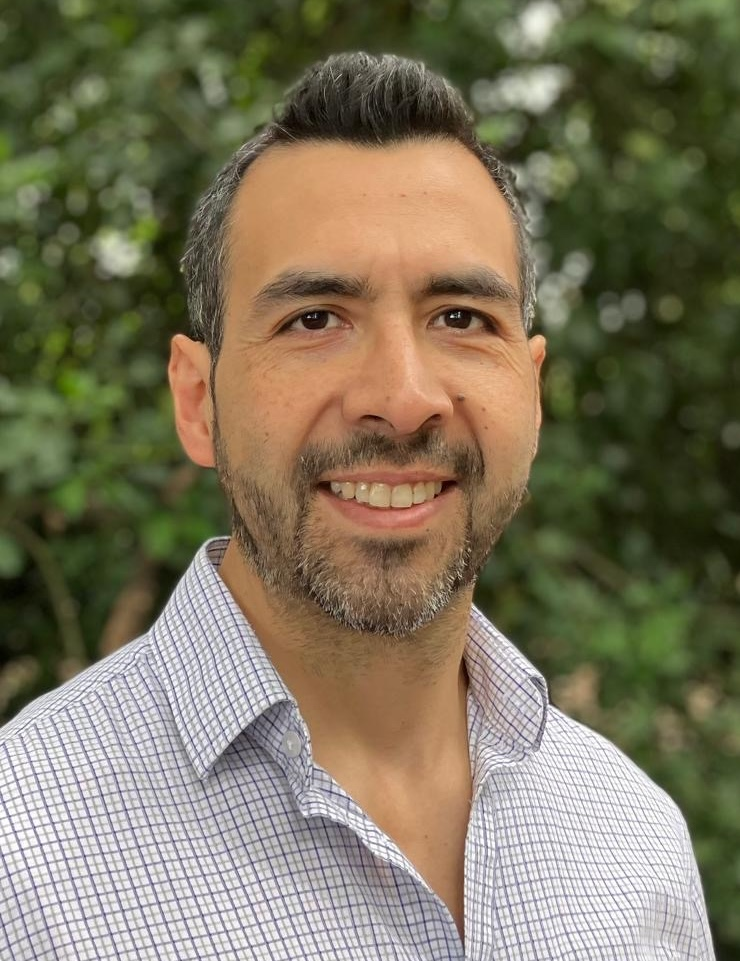

:::: {.columns}
::: {.column width="40%" .text-center}

{fig-alt="Marco Iglesias" style="border-radius:80%; width:220px;"}

### **Marco Iglesias**

Associate Professor of Scientific Computation  
School of Mathematical Sciences  
University of Nottingham  

<a href="https://scholar.google.com/citations?user=TDlj6SQAAAAJ&hl=en">Google Scholar</a> 
<a href="https://github.com/Marco-Iglesias-Nottingham">GitHub</a>

:::

::: {.column width="60%"}
## Welcome

I am an Associate Professor of Scientific Computation in the [School of Mathematical Sciences](https://www.nottingham.ac.uk/mathematics) at the [University of Nottingham](https://www.nottingham.ac.uk). My research lies in **computational inverse problems**, with a focus on Bayesian methods for PDE-constrained inversion and uncertainty quantification. I also develop deep learning–based surrogate models to accelerate inference in large-scale applications.

My work is motivated by applications in composite manufacturing, geophysics, civil engineering, and medical imaging.

:::
::::

