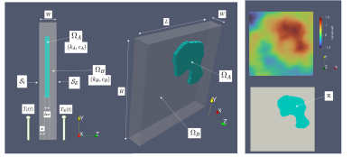
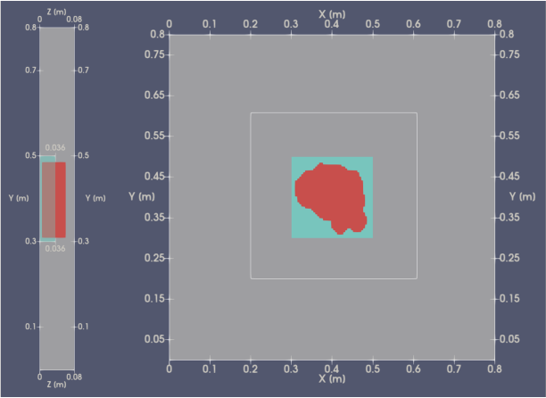
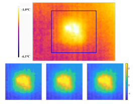
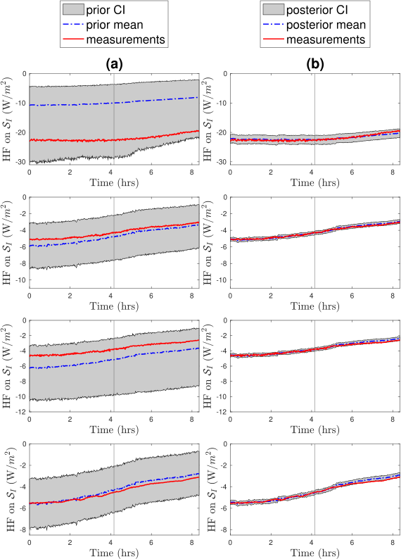

::: {.callout-note title="👥 Collaborators"}
- *Yupeng Wu (Architecture and Built Environment, Faculty of Engineering, University of Nottingham)*
- *Christopher Wood (Architecture and Built Environment, Faculty of Engineering, University of Nottingham)*
:::

In the UK, a large proportion of carbon emissions are attributable to the built environment. It is estimated that around 80% of the buildings that will be standing in 2050 already exist today, making the retrofitting of the current housing stock essential for meeting decarbonisation targets. External walls are a particularly important focus, as they account for a significant fraction of heat losses in buildings. My research in this area has focused on developing techniques to accurately characterise the thermal performance of walls using in-situ measurements.
Early work explored the use of Bayesian inversion based on one-dimensional heat transfer models [@DESIMON2018220; @Iglesias_2018; @IGLESIAS2018417], demonstrating that Bayesian approaches can reliably estimate key thermal performance parameters from field data. However, in existing buildings, walls often contain thermal bridges arising from material degradation, construction details, or defects. In such cases, one-dimensional models are insufficient, and higher-dimensional descriptions are required.
To address this challenge, in [@IGLESIAS2024114558] we employed a three-dimensional heat transfer model within an Ensemble Kalman Inversion (EKI) framework, combined with level-set parameterisations, to characterise wall thermal performance in the presence of thermal bridges. The proposed approach was validated using real experimental data, demonstrating its ability to capture complex heat transfer behaviour in realistic building envelopes.

{fig-alt="Schematic diagram" width="70%"}

::: columns
::: column

{#fig-a}

{#fig-b}

:::

::: column
{#fig-c}

:::
:::

::: {.callout-note title="References"}
::: {#refs}
:::
:::
