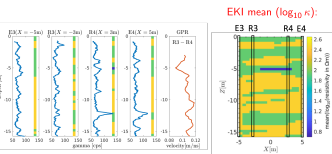

::: {.callout-note title="👥 Collaborators"}
- *Andy Binley (Lancaster University)*
- *Michael Tso (UK Centre for Ecology and Hydrology)*
- *Oliver Kuras (British Geological Survey)*
- *Paul Wilkinson (British Geological Survey)*

:::

{fig-alt="Schematic diagram" width="70%"}

::: {.callout-note title="References"}
::: {#refs}
:::
:::